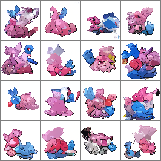
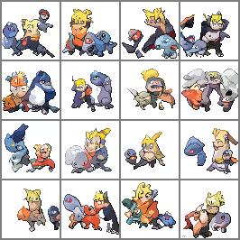

# CLIP Guided Diffusion Pokemon

Script version of Notebook made by [@nshepperd](https://twitter.com/nshepperd1)

<blockquote class="twitter-tweet"><p lang="en" dir="ltr">64x64 pixel art sprites CLIP guided diffusion notebook <a href="https://t.co/mIO90LNhU0">https://t.co/mIO90LNhU0</a> <a href="https://twitter.com/RiversHaveWings?ref_src=twsrc%5Etfw">@RiversHaveWings</a></p>&mdash; nshepperd (@nshepperd1) <a href="https://twitter.com/nshepperd1/status/1446478687298207749?ref_src=twsrc%5Etfw">October 8, 2021</a></blockquote> <script async src="https://platform.twitter.com/widgets.js" charset="utf-8"></script>


```
usage: gen.py [-h] [--seed SEED] [--float64] [--no-float64] [--prompt PROMPT] [--cgs CGS] [--eta ETA] [--batch_size BATCH_SIZE] [--image_size IMAGE_SIZE] [--steps STEPS]

Written by nshepperd: 
Generates pixel artwork from a prompt using a diffusion model trained on pokemon sprites.
Thanks Katherine Crowson (https://github.com/crowsonkb, https://twitter.com/RiversHaveWings) for the diffusion model design :)"

optional arguments:
  -h, --help            show this help message and exit
  --seed SEED           Seed for random number generator (default: 0)
  --float64             Sample in float64 to fix nondeterminism of CLIPs backward (default: False)
  --no-float64
  --prompt PROMPT       Prompt for CLIP guidance (default: a blue fairy type pokemon with wings #pixelart)
  --cgs CGS             Strength of conditioning | factor multiplied by loss (default: 2000)
  --eta ETA             The amount of noise to add each timestep when sampling. 0 is none and 1 is max (default: 1.0)
  --batch_size BATCH_SIZE
                        Batch Size (# of samples gen) (default: 16)
  --image_size IMAGE_SIZE
                        Image size. Was trained on 64x64. Must be a multiple of 8 but different sizes are possible. (default: 64)
  --steps STEPS         Number of steps for sampling, more = better quality generally (default: 250)
```

## Setup

```
git clone https://github.com/NasirKhalid24/Pokemon-Sprites-CLIP.git
pip install -r requirements.txt
```

## Usage

```
python gen.py --prompt="fire type turtle shell pokemon #pixelart" --batch_size=5
```


## Samples

```
python gen.py --prompt="a blue and pink pokemon resembling candy #pixelart"
```



```
python gen.py --prompt="naruto pokemon #pixelart"
```

